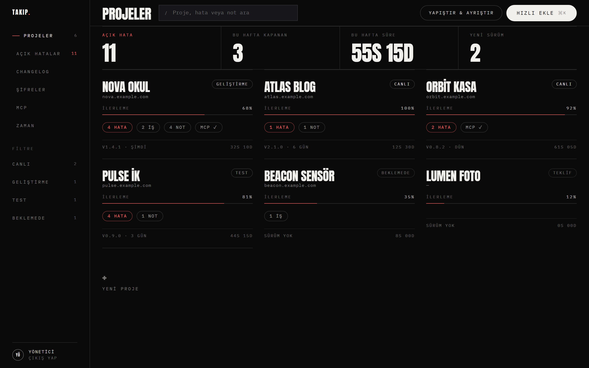
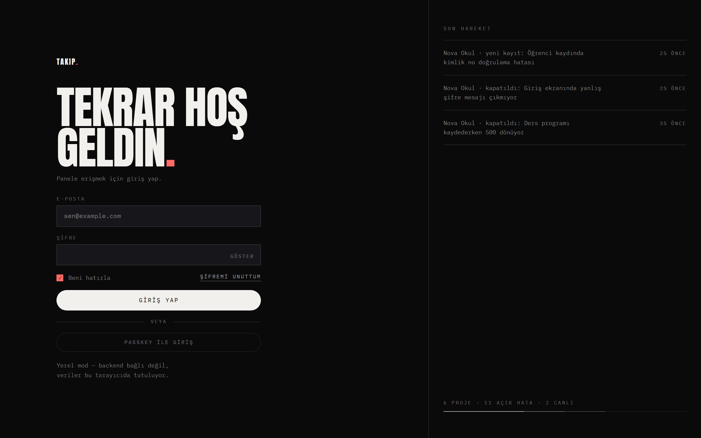
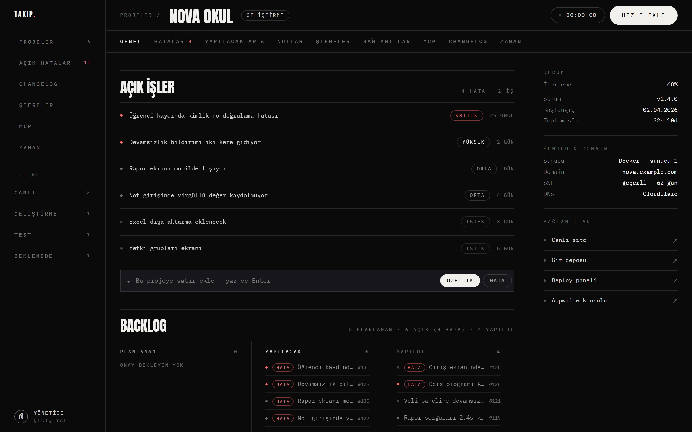
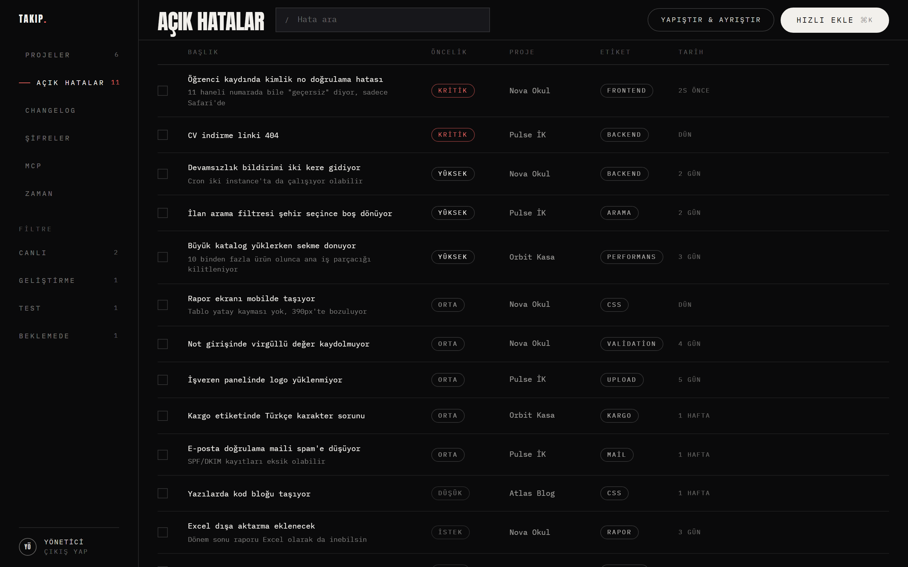
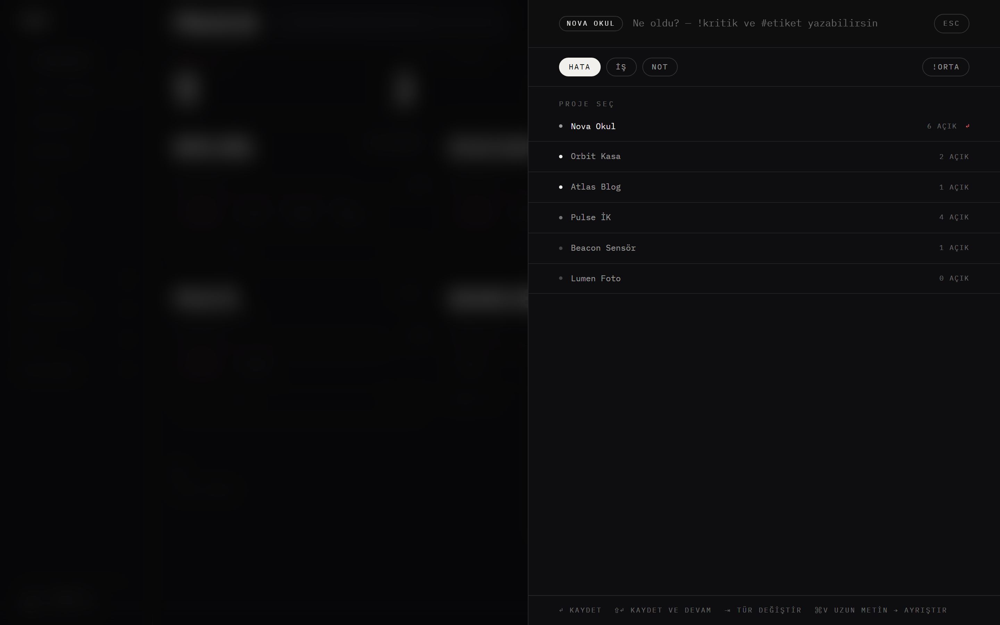
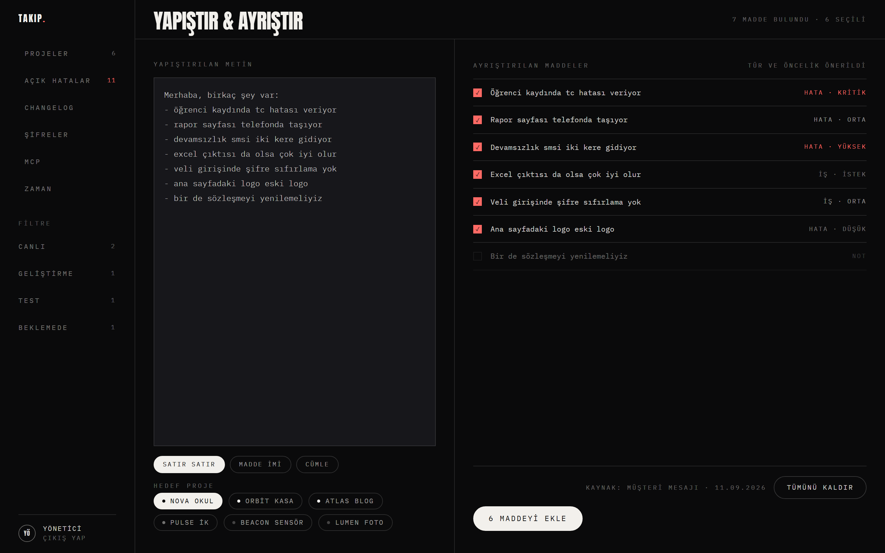
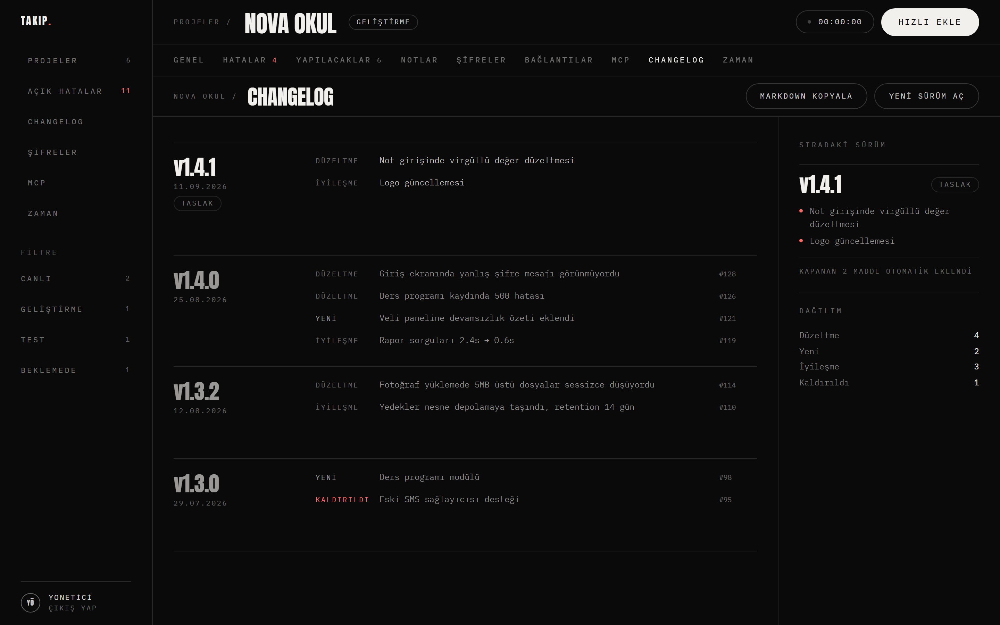
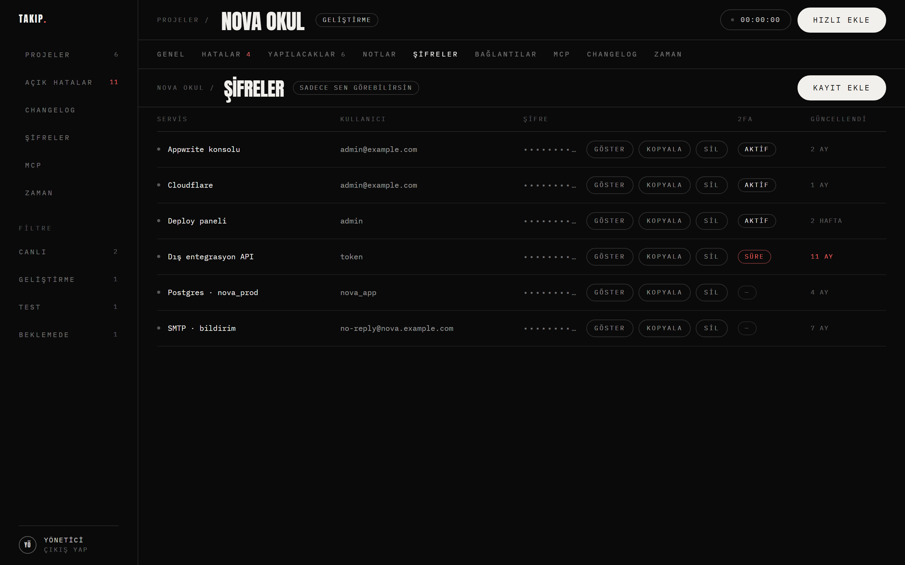
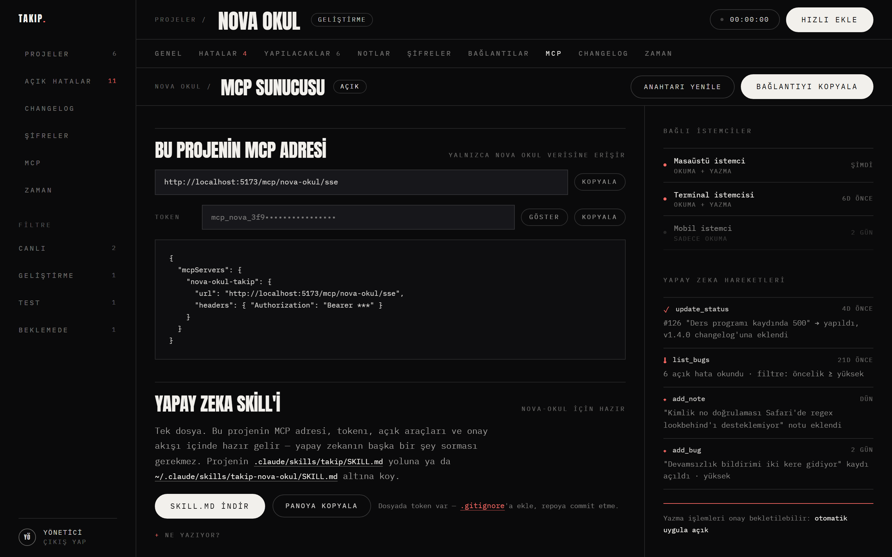

# Proje Takip Sistemi

Tek kişilik kullanım için proje takip paneli. Dışarıdan gelen bir hata bildirimini
tek satırda kaydeder, "yapıldı" işaretlediğinde changelog'u kendisi yazar, ve her
projeye yapay zekanın bağlanabileceği kendi MCP sunucusunu verir.

Koyu geliştirici paneli · React + TypeScript · Appwrite · MCP



---

## Neden

Hedeflenen döngü: *"Dışarıdan şu hata var denince direkt projeye not alınsın,
yapıldı diye düzeltilince changelog tutulsun."*

Sistem tam olarak bunu yapar:

```
dışarıdan hata gelir
   │
   ├── ⌘K ile tek satır                    → "TC doğrulama patlıyor !kritik #frontend"
   └── uzun müşteri mesajı yapıştır        → maddelere bölünür, tür + öncelik önerilir
   │
   ▼
açık hatalar listesine düşer
   │
   ▼  kutucuğu işaretle (ya da yapay zeka update_status çağırır)
   │
madde kapanır → açık taslak sürümün changelog'una otomatik eklenir
   │
   ▼  "Yeni sürüm aç"
taslak yayına alınır, projenin sürüm numarası güncellenir
```

Bu akış tek yerde tanımlı (`shared/src/service.ts`), arayüz ve MCP sunucusu aynı
koddan geçer — yapay zeka bir hatayı kapattığında changelog elle kapatmışsın gibi
güncellenir.

---

## Özellikler

**Projeler** — durum (Teklif / Geliştirme / Test / Canlı / Beklemede / Arşiv),
ilerleme yüzdesi, sürüm, açık hata sayısı, harcanan süre. Kart ızgarası ve durum filtreleri.

**Backlog panosu** — Genel sekmesinde üç sütun: **Planlanan · Yapılacak · Yapıldı**.
Hata olarak işaretli kayıtlar `HATA` rozetiyle ayrışır, sayıları başlıkta görünür.
Sütun başlığına ya da bir satıra tıklamak ilgili sekmeye götürür.

**Tek liste, iki görünüm** — *Yapılacaklar* ana listedir, her şey orada durur.
*Hatalar* aynı listenin hata olarak işaretlenmişlere süzülmüş hâlidir; hataların
ayrı bir kovası yoktur. Eklerken **Özellik / Hata** seçilir, seçim kaydın
Hatalar'da da görünüp görünmeyeceğini belirler.

**Hata & iş listesi** — öncelik (Çok önemli / Kritik / Yüksek / Orta / Düşük /
İstek), bildiren, etiket. Satır içi sözdizimi: `!çokönemli`, `!kritik` önceliği,
`#etiket` etiketi belirler ve başlıktan çıkar. Liste önce duruma, sonra önceliğe
göre dizilir.

**Madde detayı** — bir satırın başlığına tıklamak detay penceresini açar:
açıklama, bildiren, tarihler, düştüğü sürüm, başlıkla eşleşen notlar ve maddeye
yapılabilecek her şey (onayla / yapıldı / plana al / düzenle / sil). `Esc` kapatır.

**Kendini tazeler** — veri panelden başka yerlerden de değişiyor (MCP üzerinden
yapay zeka, başka bir sekme). Ekran 15 saniyede bir kendini günceller, sekme
arkadayken durur, öne gelince hemen tazeler. F5 gerekmez.

**Yapıştır & ayrıştır** — müşterinin uzun WhatsApp mesajını yapıştır, maddelere bölsün.
Her maddeye hata mı iş mi olduğunu ve önceliğini önerir; sözleşme/fatura gibi konuları
not olarak ayırır ve seçimsiz bırakır. Üç bölme modu: satır satır, madde imi, cümle.

**Otomatik changelog** — kapanan her madde açık taslak sürüme düşer, düzeltme/yeni/iyileşme/
kaldırıldı olarak sınıflanır, kaynak madde numarasıyla (`#126`) bağlanır. Markdown olarak kopyalanır.

**Şifreler & erişimler** — varsayılan gizli, tıkla-göster, tek tıkla kopyala. 2FA durumu
ve uzun süredir yenilenmemiş kayıtlar işaretlenir.

**Notlar** — her notun bir önem derecesi var: **Çok önemli / Normal / Az önemli**.
Önemliler listenin üstüne çıkar, sol kenarından kırmızıyla işaretlenir, tek düğmeyle
yalnız onlar süzülür. Yapay zeka da `list_notes --min_importance` ile aynı süzmeyi yapar.

**Bağlantılar, sunucu & domain bilgisi, zaman takibi** — başlıktaki kronometre
durdurulduğunda süre kaydı olarak yazılır.

**MCP sunucusu** — her projenin kendi adresi ve kendi tokenı. Yapay zeka o projenin
hatalarını okur, yenisini açar, kapatır, not yazar. Şifreler ve silme kapalı gelir.

---

## Ekranlar

| | |
|---|---|
| **01 · Giriş**<br>Sağ panelde son hareketler ve proje dağılımı |  |
| **02 · Ana ekran**<br>İstatistik şeridi + proje kartları |  |
| **03 · Proje detay**<br>9 sekme, sağda durum/sunucu/bağlantılar |  |
| **04 · Hata listesi**<br>Kutucuk işaretlenince changelog'a düşer |  |
| **05 · Hızlı ekleme**<br>⌘K, her ekrandan |  |
| **06 · Yapıştır & ayrıştır**<br>Uzun mesaj → maddeler |  |
| **07 · Changelog**<br>Kapanan maddelerden otomatik |  |
| **08 · Şifreler**<br>Gizli · tıkla-göster · kopyala |  |
| **09 · MCP sunucusu**<br>Araç anahtarları ve yapay zeka günlüğü |  |

---

## Hızlı başlangıç

```bash
npm install
npm run dev          # http://localhost:5173
```

`web/.env` yoksa uygulama **yerel modda** açılır: örnek veriyle dolu gelir, kayıtlar
tarayıcıda (`localStorage`) durur. Giriş ekranına herhangi bir e-posta ve en az 4
karakterlik bir şifre yeter. Backend kurmadan her ekranı gezebilirsin.

---

## Yapı

```
shared/    tipler, iş kuralları, Türkçe ayrıştırıcı, veri adaptörleri
web/       React + Vite + TypeScript arayüz
mcp/       MCP sunucusu (SSE + Streamable HTTP)
scripts/   Appwrite kurulum scripti
docs/      ekran görüntüleri, geliştirici notları
```

Veri erişimi tek bir arayüzün (`TakipRepo`) arkasında. İki uygulaması var:
`AppwriteRepo` (gerçek backend) ve `LocalRepo` (tarayıcı / bellek). Arayüz ve MCP
sunucusu yalnızca bu arayüzü tanır, dolayısıyla ikisi de her iki modda çalışır.

| Katman | Ne yapar |
|---|---|
| `shared/src/types.ts` | Alan modeli — proje, madde, not, sürüm, changelog, şifre, bağlantı, zaman, MCP |
| `shared/src/service.ts` | İş kuralları: madde ekleme, kapatma → changelog, sürüm yayınlama |
| `shared/src/parse.ts` | `!öncelik` / `#etiket` sözdizimi ve yapıştırılan metnin ayrıştırılması |
| `shared/src/changelog.ts` | Sürüm karşılaştırma, yama numarası, markdown çıktısı |
| `shared/src/repo.ts` | Veri erişim arayüzü |

---

## Appwrite'a bağlama

1. Appwrite konsolunda `takip` kimliğiyle bir proje aç.
2. `databases.write` + `collections.write` yetkisi olan bir API anahtarı üret.
3. `.env.example` → `.env`, anahtarı yaz.
4. Koleksiyonları kur:

```bash
node scripts/setup-appwrite.mjs           # sadece şema
node scripts/setup-appwrite.mjs --seed    # şema + örnek veri
```

Script tekrar çalıştırılabilir: var olan kaynakları atlar, eksikleri tamamlar.

5. `web/.env.example` → `web/.env`, doldur. Bundan sonra arayüz gerçek backend'e
   bağlanır ve giriş Appwrite hesabıyla yapılır.

**Koleksiyonlar:** `projects`, `items`, `notes`, `releases`, `change_entries`,
`credentials`, `links`, `time_entries`, `mcp_configs`, `mcp_clients`, `mcp_logs`

---

## MCP sunucusu

```bash
npm run build
npm run mcp          # :8787
```

| Uç nokta | Ne için |
|---|---|
| `GET /mcp/<proje>/sse` | SSE akışı |
| `POST /mcp/<proje>/messages` | SSE oturumunun mesaj kanalı |
| `ALL /mcp/<proje>` | Streamable HTTP (yeni istemciler) |
| `GET /health` | Sağlık |

Her istek `Authorization: Bearer <token>` ister. Token yalnızca kendi projesinin
verisini açar — bir projenin tokenıyla başka projeye istek 401 döner.

Claude Desktop / Claude Code yapılandırması (adres ve token MCP sekmesinden kopyalanır):

```json
{
  "mcpServers": {
    "nova-okul-takip": {
      "url": "https://takip.example.com/mcp/nova-okul/sse",
      "headers": { "Authorization": "Bearer mcp_nova_..." }
    }
  }
}
```

### Araçlar

| Araç | Erişim | Varsayılan | Ne yapar |
|---|---|---|---|
| `list_bugs` | okuma | açık | Açık hataları önceliğe göre listeler |
| `get_bug` | okuma | açık | Tek hatanın detayı + ilgili notlar |
| `add_bug` | yazma | açık | Yeni hata veya iş kaydı açar |
| `update_status` | yazma | açık | Yapıldı işaretler, changelog'a düşürür |
| `add_note` | yazma | açık | Projeye not yazar (önem derecesiyle) |
| `get_changelog` | okuma | açık | Sürüm geçmişini okur |
| `add_plan` | yazma | açık | Planlanan öneri yazar — onay bekler |
| `list_plans` | okuma | açık | Onay bekleyen planları okur |
| `update_plan` | yazma | açık | Onay bekleyen planı düzenler |
| `delete_plan` | yazma | açık | Onay bekleyen planı siler |
| `approve_plan` | riskli | **kapalı** | Planı yapılacağa çevirir |
| `list_notes` | okuma | açık | Notları okur, önem derecesine göre süzer |
| `search` | okuma | açık | Hata, iş, not ve changelog içinde arar |
| `project_status` | okuma | açık | Durum, sürüm, açık kayıt sayıları, kritikler, süre |
| `update_bug` | yazma | açık | Başlık, açıklama, öncelik, bildiren, etiket düzenler |
| `reopen_bug` | yazma | açık | Kapatılmış kaydı yeniden açar |
| `log_time` | yazma | açık | Harcanan süreyi kaydeder |
| `add_release` | yazma | açık | Geçmişe dönük sürüm + changelog satırları yazar |
| `add_done_items` | yazma | açık | Geçmişte çözülmüş kayıtları tarihleriyle toplu yazar |
| `add_changelog_entries` | yazma | açık | Var olan bir sürüme changelog satırı ekler |
| `set_project_version` | yazma | açık | Projenin görünen sürüm numarasını belirler |
| `publish_release` | riskli | **kapalı** | Taslak sürümü yayına alır |
| `get_credentials` | gizli | **kapalı** | Şifre ve erişim bilgileri |
| `delete_item` | riskli | **kapalı** | Kayıt siler |
| `delete_release` | riskli | **kapalı** | Sürümü ve changelog satırlarını siler |

Kapalı araçlar sunucuya hiç kaydedilmez — istemci onları listede göremez, çağırırsa
"tool not found" alır. MCP sekmesindeki anahtarlardan açılıp kapanır.

### Onay akışı — yapay zeka doğrudan iş açmaz

```
   yapay zeka önerir           yönetici onaylar          yapay zeka yapar
        │                            │                          │
   add_plan                    (panelden ONAYLA)          update_status
        ▼                            ▼                          ▼
   PLANLANAN  ──────────────►   YAPILACAK   ────────────────►  YAPILDI
   (iş değil)                   (iş budur)                (changelog'a düşer)
```

Yapay zekanın "şunu da yapsak" dediği her şey `add_plan` ile **planlanan**
olarak düşer: iş listesinde görünmez, sayılara girmez. Kendi önerisini
`update_plan` ile düzeltir, `delete_plan` ile geri çeker — bu araçlar yalnızca
`planned` kayda dokunur, onaylanmış işe zarar veremez.

Onayı sen verirsin: hata/yapılacak listesinde **PLANLANAN** şeridine geç,
satırdaki **ONAYLA**'ya bas. Ters yönü de var — açık bir kaydı **PLANA AL**
ile beklemeye çekebilirsin.

Yapay zeka işe yalnızca `list_bugs`'ın döndürdüğü onaylanmış kayıtlardan
başlar; `update_status` onaylanmamış bir kaydı kapatmayı reddeder.
`approve_plan` diye bir araç var ama kapalı doğar.

### Projeye özel skill

Her projenin MCP sekmesinde **"Yapay zeka skill'i"** bölümü var: tek dosya,
`SKILL.md`. İçinde o projenin MCP adresi, tokenı, açık araç listesi, oturum
açılışı için `SessionStart` hook'u ve onay akışı hazır gelir — yapay zekanın
başka bir şey sorması gerekmez. `SKILL.md indir` ya da `Panoya kopyala`,
sonra projenin `.claude/skills/takip/SKILL.md` yoluna koy.

Dosya panelden o anki ayarlarla üretilir: MCP'de bir aracı açıp kapatınca
skill'i yeniden indir. Token içerdiği için `.mcp.json`'ı `.gitignore`'a ekle.

Genel, projeden bağımsız sürüm de repoda duruyor: **`skill/takip/SKILL.md`**.

### Geçmişi doldurmak

Panel projeden sonra kurulduysa eski sürümler ve o sürümlerde çözülmüş kayıtlar
yapay zekaya yazdırılabilir. Sıra önemli — önce sürüm, sonra kayıtlar:

```
add_release     { version: "v1.0.0", date: "2026-01-15",
                  entries: [{ kind: "new", text: "İlk sürüm" }] }

add_done_items  { items: [{ title: "Devamsızlık raporu boş çıkıyordu",
                            priority: "kritik", created_at: "2026-01-20",
                            done_at: "2026-02-10", release_version: "v1.0.0" }] }
```

`release_version` verilen kayıt o sürüme bağlanır ve changelog satırı kendiliğinden
düşer; `done_at` boş bırakılırsa kayıt açık kalır. `add_done_items` tek çağrıda
100 kayda kadar alır.

Var olan bir sürüme sonradan satır eklemek — sürüm numarasını sen verirsin:

```
add_changelog_entries { version: "v1.3.0",
                        entries: [{ kind: "fix", text: "Çakışma kontrolü düzeltildi" }] }
```

Geçmiş dolduktan sonra proje kartında hâlâ `v0.1.0` yazmasın diye:

```
set_project_version   { version: "v2.3.0" }
```

Hepsi doğrulama yapar: tanınmayan sürüm biçimi, gelecek tarih, çözülmenin açılıştan
önce olması, var olmayan sürüme bağlama ve aynı sürümü iki kez eklemek reddedilir.
`add_release` var olan bir sürümde `add_changelog_entries`'e yönlendirir;
`add_changelog_entries` de olmayan bir sürümde projedeki sürümleri listeler.

`add_release` projenin **görünen sürümüne ve açık taslağına dokunmaz** — görünen
numara `set_project_version`'ın, taslağı yayına almak `publish_release`'in işi.

Yanlış eklenen sürüm changelog ekranından silinir: satırın üstüne gelince çıkan
**SİL** düğmesi, ikinci tıklamada onaylar. Sürüm ve changelog satırları gider,
**o sürümde çıkmış maddeler silinmez** — yapıldı kalır, yalnızca sürüm bağı kopar.
Yapay zeka tarafında karşılığı `delete_release`, `delete_item` gibi kapalı doğar.

Her çağrı `mcp_logs`'a düşer ve arayüzdeki "yapay zeka hareketleri" panelinde görünür.

Uçtan uca deneme:

```bash
npm run mcp &
node mcp/test-client.mjs
```

---

## Kısayollar

| Tuş | Ne yapar |
|---|---|
| `⌘K` / `Ctrl+K` | Hızlı ekleme paneli |
| `/` | Arama alanına odaklan |
| `↵` | Kaydet |
| `⇧↵` | Kaydet ve devam |
| `⇥` | Hızlı eklemede tür değiştir (hata / iş / not) |
| `Esc` | Paneli kapat |
| `!kritik` `!yüksek` `!orta` `!düşük` `!istek` | Satır içinde öncelik |
| `#etiket` | Satır içinde etiket |

---

## Rotalar

| Ekran | Rota |
|---|---|
| Giriş | `/giris` |
| Ana ekran | `/` · `/?durum=canli` |
| Proje detay | `/proje/:slug` |
| Hatalar / Yapılacaklar | `/proje/:slug/hatalar` · `/yapilacaklar` |
| Notlar · Şifreler · Bağlantılar | `/proje/:slug/notlar` · `/sifreler` · `/baglantilar` |
| MCP · Changelog · Zaman | `/proje/:slug/mcp` · `/changelog` · `/zaman` |
| Yapıştır & ayrıştır | `/yapistir` |
| Tüm projeler geneli | `/hatalar` `/changelog` `/sifreler` `/mcp` `/zaman` |

---

## Deploy

Örnek hedef: **`takip.example.com`** — arayüz kökte, MCP sunucusu `/mcp` yolunda.

Tek komut:

```bash
export DOMAIN=takip.example.com ZONE=example.com
export GH_OWNER=<github-kullanıcı> GH_REPO=<repo>
export APPWRITE_ENDPOINT=https://appwrite.example.com/v1
export APPWRITE_API_KEY=...      # databases.write + collections.write yetkili
SEED=1 ./scripts/deploy.sh
```

Appwrite koleksiyonlarını kurar, Cloudflare'de A kaydını açar, Dokploy'da compose'u
oluşturup iki domaini bağlar ve deploy eder. Aşamalar ayrı ayrı da çalışır
(`appwrite` / `dns` / `dokploy` / `verify`). Elle yapılışı ve sorun giderme:
**[`docs/deploy.md`](docs/deploy.md)**

Yerelde denemek için:

```bash
docker compose up -d --build
```

İki imaj var: `web/Dockerfile` (Vite build → nginx) ve `mcp/Dockerfile` (Node).
Dikkat edilecek iki nokta:

- **`VITE_*` değişkenleri build anında gömülür.** Arayüz statik bir SPA olduğu için
  çalışma anında verilen değer işe yaramaz; compose bunları `build.args` ile geçirir.
  Değiştirince yeniden **build** gerekir, restart yetmez.
- **Traefik `/mcp` önekini kesmemeli** (`stripPath: false`). MCP sunucusunun rotaları
  o öneki içeriyor.

---

## Komutlar

```bash
npm run dev                       # arayüz (Vite)
npm run build                     # shared → web → mcp
npm run typecheck                 # üç paketi de kontrol et
npm run mcp                       # MCP sunucusu
npm run setup:appwrite -- --seed  # Appwrite koleksiyonları + örnek veri
```

---

## Bilinmesi gerekenler

- **Şifreler Appwrite'ta düz metin durur.** Koleksiyon izinleri `users` rolüyle
  sınırlı ve `get_credentials` aracı kapalı, ama gerçek bir kasa istiyorsan
  `credentials.secret` alanına yazmadan önce bir şifreleme katmanı gerekir — şu an yok.
- **Yerel mod ile Appwrite modu arasındaki tek fark veri kaynağıdır.** Ekranlar ve iş
  kuralları aynı kodu kullanır.
- Arayüz FY tasarım dilindedir: Anton (başlık, daima büyük harf) + IBM Plex Mono (gövde, etiket), tek vurgu Coral, kart ve gölge yok. Token'lar `web/src/styles/tokens.css`, bileşen stilleri `web/src/styles/app.css`.
- Örnek veri (`shared/src/seed.ts`) kurgusaldır; gerçek proje, hesap ya da şifre içermez.

---

Geliştirme notları: [`docs/gelistirici-notlari.md`](docs/gelistirici-notlari.md)
